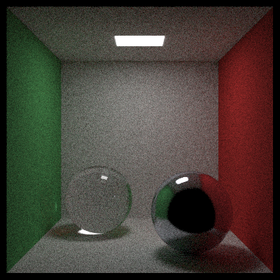
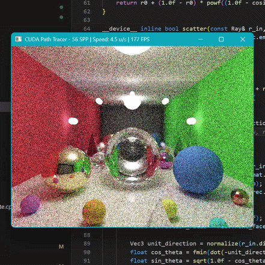

# CUDA Monte Carlo Path Tracer

[](https://opensource.org/licenses/MIT)
[]()
[]()
[]()

A high performance, GPU accelerated Monte Carlo path tracer built entirely from scratch in C++ and CUDA. This renderer solves the rendering equation iteratively on the GPU without using any external rendering frameworks like OptiX or Embree. Every intersection, bounding volume traversal, and material scattering function is hand-coded to demonstrate the core mathematical foundations of physically based rendering.

<table>
<tr>
<td width="50%"><br><em>Cornell Box · 1024 SPP · 365 Mrays/s</em></td>
<td width="80%"><br><em>Interactive Preview · CUDA-OpenGL Interop</em></td>
</tr>
</table>

---

## 🚀 Key Features

*   **100% From Scratch**: No graphics APIs or ray tracing frameworks. Pure math and CUDA kernels.
*   **GPU Accelerated**: Embarrassingly parallel — one thread per pixel, one kernel launch renders a full frame.
*   **🎮 Real-Time Interactive Preview**: Fly through scenes with WASD + mouse via CUDA-OpenGL interop. Progressive refinement — starts noisy, converges to clean image when idle.
*   **Bounding Volume Hierarchy (BVH)**: $O(\log N)$ scene traversal via a stack-based iterative BVH walker.
*   **4 Material Types**: Lambertian, Metal (roughness), Dielectric (glass/Snell's law/Fresnel), and Emissive (area lights).
*   **Russian Roulette Termination**: Unbiased probabilistic path termination to safely prevent infinite recursion.
*   **Stochastic Anti-Aliasing**: Sub-pixel jitter with progressive multi-sample accumulation.
*   **Dual Output**: Renders to both PNG (`stb_image_write`) and PPM simultaneously.

---

## 📐 Mathematical Foundation

Every component is implemented from explicit equations — no black-box calls.

| Component | Mathematical Model | Formula / Implementation |
| :--- | :--- | :--- |
| **Ray Equation** | Parametric Line | $P(t) = O + t \cdot D$ |
| **Rendering Equation** | Monte Carlo Integration | $L_o = L_e + \int f_r \cdot L_i \cdot (\omega_i \cdot n) \, d\omega_i$ |
| **Sphere Intersection** | Quadratic Formula | $(D \cdot D)t^2 + 2(D \cdot (O-C))t + (O-C)^2 - r^2 = 0$ |
| **Triangle Hit** | Möller–Trumbore | Barycentric coordinates, no explicit plane intersection |
| **Refraction** | Snell's Law | $\eta \sin\theta_i = \eta' \sin\theta_t$ |
| **Fresnel** | Schlick's Approximation | $R(\theta) = R_0 + (1-R_0)(1-\cos\theta)^5$ |
| **Gamma Correction** | sRGB | $C_{out} = \sqrt{C_{in}}$ |

---

## 📊 Benchmark

Measured on a laptop with **NVIDIA RTX 3060 (Ampere, sm_86)**.

| Scene | Resolution | SPP | Max Depth | Total Rays | Render Time | Throughput |
| :--- | :--- | :--- | :--- | :--- | :--- | :--- |
| **Cornell Box** | 400×400 | 64 | 10 | 10.2M | 0.038s | ~269 Mrays/s |
| **Cornell Box** | 400×400 | 1024 | 10 | 163.8M | 0.449s | **365 Mrays/s** |

---

## 📋 Requirements

*   **NVIDIA GPU**: Ampere architecture or newer (sm_86 targeted by default).
*   **CUDA Toolkit**: 13.x recommended (11.8+ with compatible MSVC).
*   **C++ Compiler**: C++17 (MSVC on Windows, GCC/Clang on Linux).
*   **CMake**: 3.21+.
*   **GLFW 3.3+**: Auto-fetched by CMake via FetchContent — no manual install needed.

---

## 📥 Building

### Windows (Visual Studio 2022)
```bash
mkdir build && cd build
cmake .. -G "Visual Studio 17 2022" -A x64
cmake --build . --config Release
```

### Linux
```bash
mkdir build && cd build
cmake .. -DCMAKE_BUILD_TYPE=Release
make -j$(nproc)
```

> **Note**: If using CUDA 13.x with MSVC 2022, ensure the `CUDA_PATH_V13_1` environment variable and the CUDA MSBuild integration files are set up correctly. See the build troubleshooting section below.

---

## 📖 Usage

### Offline Render
```bash
./cuda_path_tracer <scene.json> [output.png]
```

### Interactive Preview
```bash
./cuda_path_tracer <scene.json> --preview
```

Opens a real-time window with CUDA-OpenGL interop. The path tracer renders progressively — move the camera and it resets to 1 SPP for instant feedback, then refines when idle.

| Control | Action |
| :--- | :--- |
| **WASD** | Move forward / left / back / right |
| **E / Space** | Move up |
| **Q / Shift** | Move down |
| **Mouse** | Look around |
| **Scroll** | Adjust movement speed |
| **ESC** | Quit and save final image |

### Example
```bash
./build/Release/cuda_path_tracer.exe config/gallery.json --preview
./build/Release/cuda_path_tracer.exe config/cornell_box.json renders/cornell.png
```

### Scene Configs

| Config | Description |
| :--- | :--- |
| `config/cornell_box.json` | Classic Cornell Box — red/green walls, area light, metal + glass spheres |
| `config/gallery.json` | Enclosed gallery room — mirror wall, ceiling light, pyramids, 30+ objects |
| `config/showcase.json` | Open-world scene — sky, ground plane, hero spheres, scattered objects |

Scene files are JSON with configurable resolution, SPP, max bounce depth, camera, materials, and geometry.

---

### CUDA Kernel Details

| Parameter | Value |
| :--- | :--- |
| **Thread Block** | 8×8 (64 threads) |
| **RNG** | Per-thread `curandState` (XORWOW) |
| **Path Termination** | Russian Roulette after depth 3 |
| **Memory** | Flat arrays of `Primitive` and `Material` structs — no pointers, no virtual dispatch |

---

## 🔧 Build Troubleshooting

### `No CUDA toolset found`
Copy the CUDA MSBuild extensions to Visual Studio:
```powershell
Copy-Item "C:\Program Files\NVIDIA GPU Computing Toolkit\CUDA\v13.X\extras\visual_studio_integration\MSBuildExtensions\*" `
  "C:\Program Files\Microsoft Visual Studio\2022\Community\MSBuild\Microsoft\VC\v170\BuildCustomizations\" -Force
```

### `CudaToolkitDir '' does not exist`
Set the system environment variable:
```powershell
[System.Environment]::SetEnvironmentVariable("CUDA_PATH_V13_x", "C:\Program Files\NVIDIA GPU Computing Toolkit\CUDA\v13.X", "Machine")
```

---

## 📜 License

MIT License. See [LICENSE](LICENSE) for details.

---


